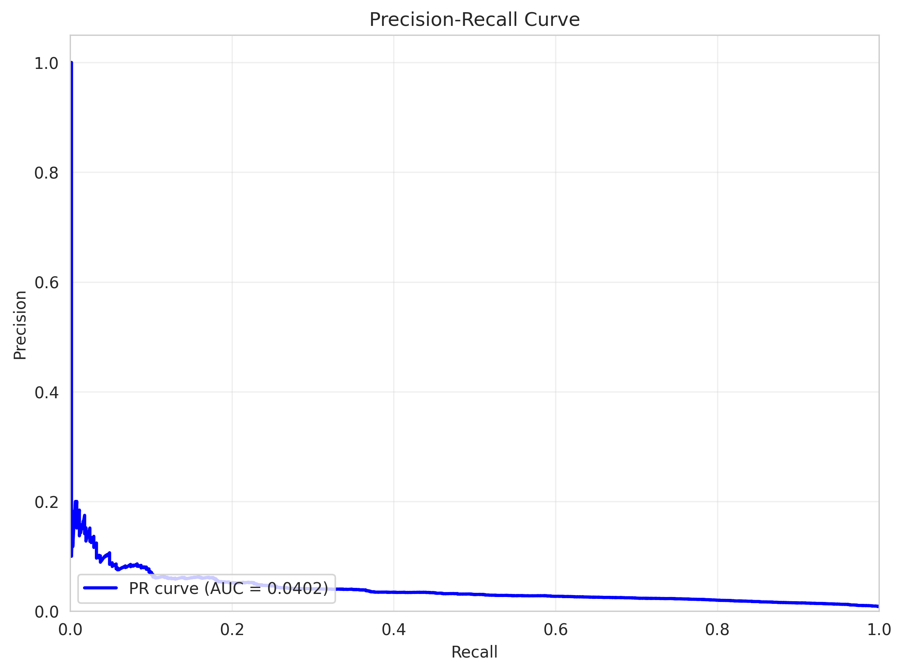
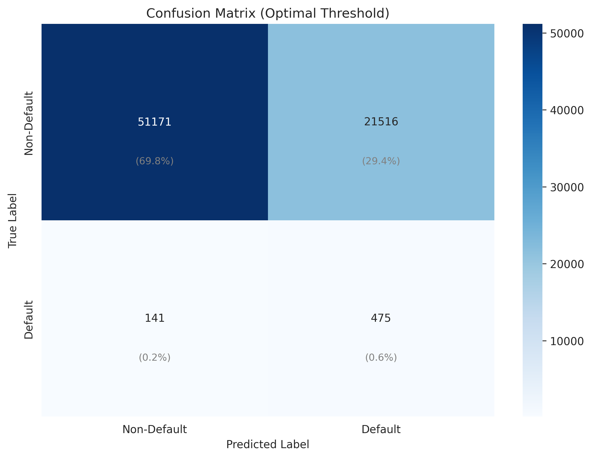

# Credit Default Prediction - Pipeline Run Summary

**Pipeline:** Unknown - N/A  
**Run ID:** nn_20260116_2  
**Generated:** 2026-01-16 20:19:13

---

## Key Performance Metrics

| Metric | Value |
|--------|-------|
| **ROC-AUC Score** | **0.8020** |
| Recall (TPR) | 77.1% |
| False Negative Rate | ✅ 22.9% |
| Precision | 2.16% |
| MCC | 0.0946 |

---

## Threshold Tuning Results

- **Optimal Threshold:** `0.008614`
- **Selection Method:** MCC
- **FNR Constraint:** ≤ 28%

### Confusion Matrix Summary

| Metric | Rate | Count |
|--------|------|-------|
| True Positives (TP) | 77.11% recall | 475 defaults caught |
| False Negatives (FN) | 22.89% missed | 141 defaults missed |
| True Negatives (TN) | 70.40% specificity | 51,171 correct non-defaults |
| False Positives (FP) | 29.60% false alarm | 21,516 false alarms |

---

## Model Performance

- **Best Model:** WeightedEnsemble_L3
- **Validation Score:** 0.8138
- **Training Time:** 503.1 seconds
- **Total Models Trained:** 12

### Model Leaderboard

| Rank | Model | Score (Val) | Fit Time (s) | Pred Time (s) |
|------|-------|-------------|--------------|---------------|
| 1 | WeightedEnsemble_L3 | 0.8138 | 503.1 | 1.258 |
| 2 | WeightedEnsemble_L2 | 0.8125 | 299.3 | 0.745 |
| 3 | NeuralNetTorch_BAG_L1 | 0.8081 | 73.9 | 0.162 |
| 4 | NeuralNetFastAI_BAG_L1 | 0.8069 | 224.4 | 0.561 |
| 5 | NeuralNetFastAI_BAG_L2 | 0.8053 | 501.3 | 1.240 |
| 6 | NeuralNetTorch_BAG_L2 | 0.8031 | 368.2 | 0.939 |
| 7 | WeightedEnsemble_L3_FULL | nan | 54.4 | nan |
| 8 | WeightedEnsemble_L2_FULL | nan | 32.9 | nan |
| 9 | NeuralNetTorch_BAG_L2_FULL | nan | 37.9 | nan |
| 10 | NeuralNetTorch_BAG_L1_FULL | nan | 5.9 | nan |

---

## Visualizations

### ROC Curve

### Precision-Recall Curve

### Confusion Matrix

### Threshold Analysis

### Model Performance Comparison

### Training Times

---

## Training Configuration

| Parameter | Value |
|-----------|-------|
| Training Years | N/A |
| Test Years | N/A |
| Model Type | N/A |
| Normalization | N/A |
| Company Exclusion | No |
| Train Samples | 171,038 |
| Test Samples | 73,303 |
| Features | 12 |

---

*Report generated on 2026-01-16 at 20:19:13*  
*Pipeline run path: `models/pipeline_runs/nn_20260116_2`*
